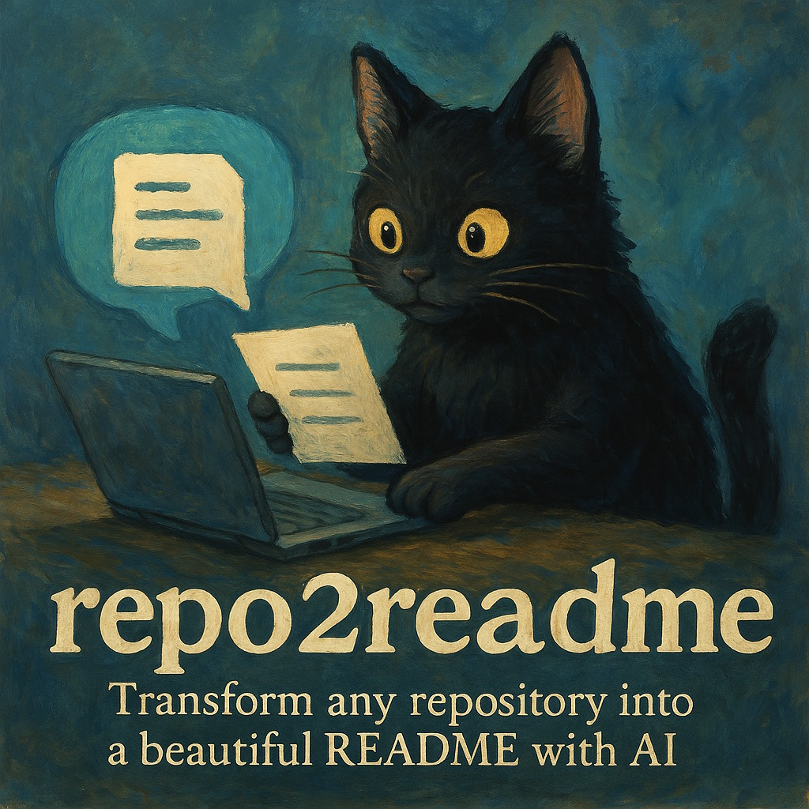

# **📦 repo2readme**
<p align="center">
  
</p>


🔹 🤖 Generate beautiful READMEs for your repositories with AI

📖 **Overview**

`repo2readme` is a command-line tool that leverages AI to automatically create clean and modern `README.md` files for your GitHub repositories.

It operates by first generating a Markdown representation of the target repository's structure and content using the external `repo2md` utility. This Markdown dump, along with a predefined system prompt outlining best practices, is then processed by an AI model via OpenRouter to produce a well-structured README. The final `README.md` is saved in the root directory of the target repository.

🚀 **Installation**

1.  Install the tool using pipx:
    ```bash
    pipx install . --force
    ```
2.  Configure your environment:
    *   The tool automatically creates a default configuration file at `~/.repo2readme/.env` on the first run if it doesn't exist.
    *   Edit this file to add your OpenRouter API key and other necessary configurations (like `MODEL_ID`). An example structure can be found in the source code at `src/repo2readme/configs/.env.example`.
    *   Ensure the `OPENROUTER_API_KEY` variable is set.

🛠️ **Usage**

Execute the tool from your terminal, providing the path to the local repository you wish to document:

```bash
repo2readme /path/to/your/repository
```

This command will:
*   Analyze the repository using `repo2md`.
*   Send the repository information to the configured AI model via OpenRouter.
*   Generate a new `README.md` file.
*   Save the generated `README.md` to the root of the target repository, overwriting any existing README file.

📄 **License**

This project is licensed under the [MIT License](LICENSE).